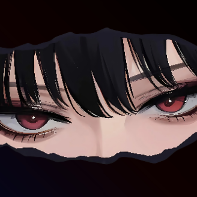

<!-- 调节尺寸并居中 -->

    <!-- width控制宽度，单位px -->

  

    

<!-- 个人标签区：调整颜色饱和度，让标签更柔和 -->
  

    
🌟 About Me

    

      Computer science enthusiast 🖥️
      cutting-edge knowledge ☕
      Full-stack exploration 🚀
      fitness & gaming lover 🎮
    

  

 

   <!-- 技术栈卡片：用容器包裹，增强模块感 -->
  

    

      
💻 Technology Stack

      

        <!-- 技术图标统一大小，添加轻微阴影 -->
        
        
        
        
        <!-- 可根据实际技能补充更多，如数据库/框架 -->
        <!--  -->
      

    

  
 

  

  <!-- 分隔线 -->
  

  

  <!-- 联系方式卡片：用容器包裹，突出重要性 -->
  

    

      
<i style="color: #2A7AE4;">✉️</i> How to reach me

      

        <a href="mailto:2308030528@qq.com" style="color: #2A7AE4; text-decoration: none; padding: 0.2rem 0.5rem; border-bottom: 1px dashed #2A7AE4;">2308030528@qq.com</a>
        |
        <a href="mailto:jxinrun99@gmail.com" style="color: #2A7AE4; text-decoration: none; padding: 0.2rem 0.5rem; border-bottom: 1px dashed #2A7AE4;">jxinrun99@gmail.com</a>
      

    

  

  <!-- GitHub 统计卡片 -->
  

    <!-- width控制宽度，单位px -->

  

  <!-- 底部结束语：添加图标点缀，更活泼 -->
  

    
✨ Feel free to reach out for discussions on Computer Science!  Let's learn and grow together! 🌟

  

<!-- 动态打字效果的图片源链接 -->
[github-sub-title:img]: https://readme-typing-svg.herokuapp.com?font=Segoe+Script&center=true&lines=mq白.